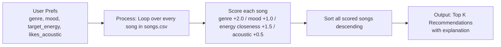

# 🎵 Music Recommender Simulation

## Project Summary

In this project you will build and explain a small music recommender system.

Your goal is to:

- Represent songs and a user "taste profile" as data
- Design a scoring rule that turns that data into recommendations
- Evaluate what your system gets right and wrong
- Reflect on how this mirrors real world AI recommenders

This version is a small content-based recommender: it scores every song in a fixed catalog against a single user's stated preferences and returns the top-k matches with a human-readable explanation for each.

---

## How The System Works

Real-world recommenders (Spotify, YouTube, etc.) mostly work by comparing an item's features against a profile built from a user's past behavior (listens, skips, likes) rather than a profile the user fills out directly, and they often blend content-based signals (song attributes) with collaborative signals (what similar users liked). This simulation focuses only on the content-based half: it assumes explicit user preferences and scores songs directly against them, with no learning from behavior over time.

**`Song` features used:** `genre`, `mood`, `energy`, `tempo_bpm`, `valence`, `danceability`, `acousticness` (loaded from `data/songs.csv`).

**`UserProfile` fields:** `favorite_genre`, `favorite_mood`, `target_energy`, `likes_acoustic`.

**Scoring rule (one song):** each song earns points based on how well it matches the user:
- Exact `genre` match: **+2.0** (weighted highest — genre is the most binding preference)
- Exact `mood` match: **+1.0**
- Energy closeness: **+1.5 × (1 - |song.energy - target_energy|)** — this rewards songs whose energy is *close* to the target rather than simply higher or lower, so a user wanting `energy=0.8` is not automatically pushed toward the highest-energy song in the catalog
- Acoustic bonus: if the user `likes_acoustic`, **+0.5 × song.acousticness**

**Ranking rule (list of songs):** every song in the catalog is scored independently, then the list is sorted by score descending and truncated to the top `k`. The scoring rule answers "how good is this one song for this user," while the ranking rule answers the separate question of "given many scored songs, which ones do we actually show, and in what order" — a system needs both because scoring is a per-item calculation and ranking is a list-level decision.

**Example user profile ("Marcus"):** `{"favorite_genre": "rock", "favorite_mood": "intense", "target_energy": 0.9, "likes_acoustic": False}`. Run against the catalog, this profile's top match is "Storm Runner" (rock, intense, energy 0.91 — score 4.48), and a `{"favorite_genre": "lofi", "favorite_mood": "chill", "target_energy": 0.35}` profile's top match is "Library Rain" (lofi, chill, energy 0.35 — score 4.50) with zero overlap in the top 3 between the two — confirming the profile fields are specific enough to separate "intense rock" from "chill lofi" rather than collapsing toward one generic answer.

### Algorithm Recipe

1. For each song in the catalog, compute a score:
   - `+2.0` if `song.genre == user.favorite_genre`
   - `+1.0` if `song.mood == user.favorite_mood`
   - `+1.5 * (1 - abs(song.energy - user.target_energy))` — always applied, rewards closeness rather than "more energy = better"
   - `+0.5 * song.acousticness` if `user.likes_acoustic` is true
2. Sort all scored songs descending by score.
3. Return the top `k` songs, each paired with a plain-language explanation built from which rules fired.

### Data Flow



### Expected Biases

- **Genre-dominant weighting**: genre is worth 2x a mood match, so this system will tend to favor "right genre, wrong mood" songs over "right mood, wrong genre" songs — it may under-recommend a great mood match if it's in an unfavored genre.
- **Exact-string matching**: `"pop"` and `"indie pop"` are treated as completely unrelated genres, so users whose stated preference doesn't exactly match the catalog's label get no credit even for a very close genre.
- **Underrepresented catalog corners**: some genres/moods in the expanded catalog (e.g., classical/melancholy, r&b/romantic) have only one song, so any user whose taste centers there has very little to differentiate among — the top recommendation will often be the *only* option rather than the *best* one.

---

## Getting Started

### Setup

1. Create a virtual environment (optional but recommended):

   ```bash
   python -m venv .venv
   source .venv/bin/activate      # Mac or Linux
   .venv\Scripts\activate         # Windows

2. Install dependencies

```bash
pip install -r requirements.txt
```

3. Run the app:

```bash
python -m src.main
```

### Running Tests

Run the starter tests with:

```bash
pytest
```

You can add more tests in `tests/test_recommender.py`.

---

## Sample Recommendation Output

User profile: genre=pop, mood=happy, energy=0.8

Terminal output from `python -m src.main`:

```
Loaded songs: 18

Top recommendations:

1. Sunrise City — Score: 4.47
   Because: genre match (+2.0); mood match (+1.0); energy 0.82 close to target 0.80 (+1.47)

2. Gym Hero — Score: 3.30
   Because: genre match (+2.0); energy 0.93 close to target 0.80 (+1.30)

3. Rooftop Lights — Score: 2.44
   Because: mood match (+1.0); energy 0.76 close to target 0.80 (+1.44)

4. Night Drive Loop — Score: 1.42
   Because: energy 0.75 close to target 0.80 (+1.42)

5. Riot Anthem — Score: 1.36
   Because: energy 0.89 close to target 0.80 (+1.36)
```

**Screenshot or video** *(optional)*: <!-- Insert a screenshot or demo video link here -->

---

## Experiments You Tried

**Lowering the genre weight from 2.0 to 0.5** (user: `genre=pop, mood=happy, energy=0.8`): with the default weights, "Sunrise City" (pop, happy, energy 0.82) clearly wins with a score of 4.47, well ahead of "Gym Hero" (pop, but wrong mood) at 3.30. Dropping genre's weight to 0.5 shrinks the gap and even lets "Rooftop Lights" (right mood, wrong genre, score 2.44) pass "Gym Hero" (right genre, wrong mood, score 1.80). This confirmed the intuition that genre should dominate mood — with a low genre weight, a mood match started outweighing a genre match, which felt wrong for how people usually describe their taste ("I want something poppy" is a harder constraint than "I want something happy").

**Different user types:**
- A chill/lofi, low-energy user (`genre=lofi, mood=chill, energy=0.3`) correctly surfaced "Library Rain" and "Midnight Coding" at the top — both lofi, chill, and close to the target energy — showing the scoring generalizes past the pop/happy example in [main.py](src/main.py).
- A user with no genre/mood preference who just wants acoustic, low-energy songs (`energy=0.4, likes_acoustic=True`) correctly surfaced "Coffee Shop Stories," "Focus Flow," and "Library Rain" — all high-acousticness, energy-close songs from different genres (jazz, lofi, lofi), showing the acoustic bonus and energy-closeness terms work independently of genre/mood when those preferences aren't specified.

I did not add `tempo_bpm` or `valence` to the score — see Limitations below.

---

## Limitations and Risks

- **Tiny catalog**: only 10 songs, so the "best" match for an unusual profile (e.g., high-energy jazz) may still be a weak match — there is nothing better in the data.
- **No listening history or feedback loop**: the system only uses a one-time stated profile (`favorite_genre`, `favorite_mood`, `target_energy`, `likes_acoustic`); it has no way to learn from skips, replays, or thumbs-down the way a real streaming recommender would.
- **Ignores valence, tempo, and danceability**: these are loaded but never scored, so two songs with wildly different tempo or "musical positivity" can tie if their genre, mood, and energy line up. A user who cares specifically about tempo (e.g., for a workout) gets no signal from this system.
- **Exact-match-only for categorical features**: genre and mood must match exactly, so a user who likes "pop" gets zero credit for "indie pop," even though a person would probably call that a close match. This makes the system brittle to how the catalog happens to label things.
- **Fixed weights favor genre by design**: genre gets the highest weight (2.0), so users whose taste is more mood-driven than genre-driven may get recommendations that feel geared toward the wrong axis of their preference.
- **No diversity control**: the top-k list can be dominated by songs from the same artist or genre (e.g., "Sunrise City" and "Night Drive Loop" are both Neon Echo), since the ranking rule sorts purely by score with no artist/genre diversity constraint.

You will go deeper on this in your model card.

---

## Reflection

Read and complete `model_card.md`:

[**Model Card**](model_card.md)

Building this made concrete something that's easy to gloss over in the abstract: a recommender doesn't "understand" music, it computes a number from whatever features happen to be in the data, and that number is only as good as the features and weights someone chose. The closeness-based scoring for energy (`1 - abs(song.energy - target)`) was the clearest example — a naive "higher energy is better" rule would have completely misrepresented what a user wanting *moderate* energy actually wants, and it's easy to imagine a real system shipping that mistake if nobody stopped to ask what "matching" should mean for a continuous feature.

The bias risk that stood out most is in the weighting and the exact-match logic: giving genre 2x the weight of mood is a design choice that bakes in an assumption about what matters most in "vibe," and it will systematically favor users whose stated genre happens to exist in the catalog under the exact label used — someone who likes "indie pop" but typed "pop" gets penalized for a labeling mismatch, not an actual taste mismatch. At a larger scale, this is the same mechanism behind real-world recommender complaints: whatever gets weighted heavily, or whatever categories the catalog encodes cleanly, ends up structurally favored, regardless of whether that reflects what users actually want.


